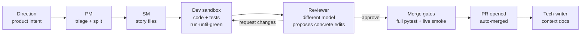

# 🏭 software-factory

**An autonomous software factory: an LLM persona pipeline that turns high-level product directions into reviewed, tested, merged pull requests — unattended, on cheap open-weight models.**


The thesis under test: **harness quality beats model size.** A well-instrumented pipeline of small, verifiable steps — each gated by real tests and a live runtime smoke check — ships production code unattended on models ~10× cheaper than frontier subscriptions. It does ship: 117 stories merged and deployed, 24 of them edits to the factory itself.

**The thesis is not proven, and the latest measurement runs against it.** Externally graded on SWE-rebench with a hidden oracle (2026-08-04, five arms, n=19, k=1 — [full result](bench/swebench/results.md)):

| arm | harness × model | resolved | rate | 95% CI |
|---|---|---:|---:|---|
| Claude Code CLI | × `claude-opus-5` | 15/19 | **79%** | [54%, 94%] |
| Claude Code CLI | × `claude-opus-4-8` | 14/19 | **74%** | [49%, 91%] |
| one OpenHands agent, **no chain** | × `azure/deepseek-v4-pro` | 7/16 | **44%** | [20%, 70%] |
| **this factory's chain** | × deepseek-v4-pro + gpt-5.3-codex + gpt-5.4 | 7/19 | **37%** | [16%, 62%] |
| hand-rolled loop, **no tool calls** | × `azure/deepseek-v4-pro` | 1/18 | **6%** | [0%, 27%] |

- **The chain shows no measurable lift over a single agent on the same model** — 37% vs 44%, McNemar exact p=0.625. The lift comes from using a competent agent loop, not from the chain.
- **What does produce lift is tooling**, not orchestration: 44% vs 6%, p=0.031.
- **And the chain costs 2.3× per resolved instance** to get there — $5.13 vs $2.20.
- Claude Code is roughly twice the factory (p=0.008), but that comparison varies harness *and* model, so it is a reference point rather than a scaffold deficit.
- n=19, k=1, MDE ≈ ±38 pp. That means "no measurable lift" — **not** "the chain hurts".

The July 2026 campaign that read the other way (7/7 vs 5/7 at $0.65/task) graded against sacrifice's *own* merge gates — tests the factory wrote — and is [superseded](bench/CAMPAIGN-2026-07-17.md).

> **An LLM agent working in this repo?** Read [`CLAUDE.md`](CLAUDE.md) first (or
> [`AGENTS.md`](AGENTS.md) if you're on a non-Claude tool) — it is the short,
> maintained orientation doc: the three loops, the 60-second health check, where
> truth lives, the operator command surface, and the hard guardrails. This
> README is the human-facing pitch; the deep per-subsystem docs live at
> `apps/factory/context/modules/*.md`.

---

## How it works



- **Directions** are markdown work orders (`apps/<app>/directions/`) — filed by you, or by the factory's own scanner personas (hourly drift watchdog, bug hunter, weekly security audit, UX auditor).
- **Personas** are prompt-defined roles (`factory/personas/*.md`) executed either as tool-using sandboxes (OpenHands SDK) or single structured-JSON calls. Model routing per persona/difficulty lives in one file: `factory/routes.yaml`.
- **Nothing merges on green unit tests alone.** The `smoke-green` gate boots the PR's own code on an isolated port and drives the core user journey live before auto-merge.
- **Convergence machinery** keeps dev↔review loops short: the reviewer carries memory of its own previous findings, proposes concrete `FIND/REPLACE` edits, and a drift clamp stops goalpost-moving at cycle 3.

## The factory manages itself

A four-tier management pipeline (FMS) watches the factory's own telemetry:

| Tier | Role | Cadence |
|------|------|---------|
| L1 Watcher | summarize event streams, flag anomalies | every 60 s |
| L2 Summarizer | structured concern documents | on escalation |
| L3 Diagnostician | root-cause + unified-diff proposal | on escalation |
| L4 Apply | classify safe/forbidden, branch, test, PR | on proposal |

Blocked stories auto-recover (bounded), stale worktrees get pruned, and a halted factory refuses to burn spend until an operator runs `factory resume`. Every factory self-edit is validated on a cloned staging copy — full suite + import/CLI smoke — before it can touch the live tree; `factory/manager/**` and `bench/**` stay forbidden to self-edit (operator PR only).

## Quickstart

```bash
uv sync --all-extras          # dev extras included — bare `uv sync` omits pytest
uv run pytest -q              # 2182 tests, ~5 min (not the ~30s of the early repo)
uv run factory --help
```

Wire an app (see `apps/sacrifice/config.yaml` for a complete example), then:

```bash
uv run factory pm-sync --app <app>   # triage directions into stories
uv run factory tick --app <app>      # one full pipeline pass
```

Continuous operation runs on two systemd user units: `factory-tick@<app>.timer` (pipeline heartbeat, 5 min) and `factory-manager.service` (FMS L1 daemon). Models and API keys are configured in `factory/routes.yaml` + `.env` (`.env.example` documents every key; Azure OpenAI, DeepSeek, and OpenRouter routing supported out of the box).

Day-to-day operator surface:

```bash
factory inbox                 # everything awaiting a human, across apps
factory status-sync --app X   # pinned [FACTORY] live-status GitHub issue
factory why <story-id>        # per-story event trail
factory resume                # clear an FMS halt (operator-only)
```

## Benchmarks

Two harnesses. Only one of them is evidence about correctness.

**`bench/swebench_adapter.py` — externally graded, five arms, hidden oracle.** Pre-registered tables, archived per-row evidence, and a `report --check` that re-derives the published table byte-for-byte or exits non-zero. The measured result is in the table at the top of this README; the full one with CIs, paired McNemar tests, per-row model ledgers and contamination margins is [`bench/swebench/results.md`](bench/swebench/results.md) ([how it works](bench/swebench/README.md)).

```bash
uv run python bench/swebench_adapter.py report \
  --from-archive bench/swebench/results-archive/2026-08-04T04-18-05.349995Z --check
```

**`bench/bench.py` — convergence only.** It grades the factory on sacrifice's own merge gates, i.e. on tests the factory wrote, so it measures whether the chain drives a story to green unattended and what that costs. It is not evidence about correctness, and its July campaign is superseded. Run it: `uv run python bench/bench.py --help` ([protocol + caveats](bench/README.md)).

## Repository map

```
factory/           the orchestrator
  chain/           state machine, handlers, gates, auto-merge, worktrees
  manager/         FMS tiers (watcher → summarizer → diagnostician → apply)
  personas/        prompt-defined roles (pm, sm, dev, reviewer, …)
  routes.yaml      per-persona model routing — the single model-choice seam
apps/<app>/        per-app config, directions (work orders), stories
bench/             benchmarks
  swebench/        externally graded, five arms, hidden oracle — the real one
  bench.py         convergence harness on the app's own gates
state/             runtime: sqlite db, event streams, worktrees (gitignored)
tests/             1086 tests
```

## Design principles

1. **Verification-first** — a feature is done when it runs live, not when tests pass. (The smoke gate exists because an early version shipped a green-but-unbootable app.)
2. **Decompose by context, not by pipeline stage** — the reviewer sees only the diff + gates + its own review history; the dev owns both code and tests.
3. **Everything loops at most 3–6 times** — retry caps, review-cycle caps, recovery caps. Nothing burns spend unbounded.
4. **The model is a config value** — swapping providers is a YAML edit; missing API keys degrade routes to a working fallback instead of crashing.
