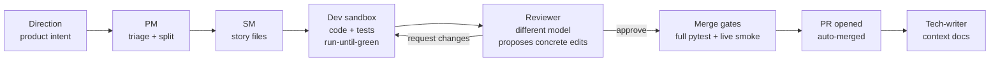

# 🏭 software-factory

**An autonomous software factory: an LLM persona pipeline that turns high-level product directions into reviewed, tested, merged pull requests — unattended, on cheap open-weight models.**


The thesis under test: **harness quality beats model size.** A well-instrumented pipeline of small, verifiable steps — each gated by real tests and a live runtime smoke check — ships production code unattended on models ~10× cheaper than frontier subscriptions. It does ship: 138 sacrifice stories, 98 of them reaching the terminal `deployed` state, at ~1.0/day currently. (Two honesty caveats, re-audited 2026-08-11: the `deployed` state records a *merge* — **109 deploy actions have produced 0 successes, 0 smoke checks and 0 health checks**, so it has never once meant deployed; and of this repo's own **248** merged PRs, **24 (9.7%)** came through the chain — the operator authored the rest.)

## The headline result: the chain is behind a single agent

**Same 18 instances, same dev model, same week, same grading.** This is the
matched comparison — it replaces the cross-sweep one that previously suggested
parity.

| arm | resolved | rate | total $ | $/resolved | median wall |
|---|---:|---:|---:|---:|---:|
| **this factory's chain** | **10/18** | **56%** | 81.00 | **8.10** | 30.1 min |
| **one OpenHands agent, no chain** | **12/18** | **67%** | 14.34 | **1.19** | 7.6 min |
| Claude Code CLI (frontier reference) | 11/14 | 79% | 30.18 | 2.74 | 4.4 min |

Paired chain vs agent: both 9 · chain-only 1 · agent-only 3 · neither 5,
**McNemar exact p = 0.625** — descriptive, not a proven delta. k ≥ 3 is the bar.

**Three things this table does not say, stated so it cannot be misread:**

- **56% is charitable to us.** The benchmark grades the *diff*; the live chain
  ships on a *verdict*. Three of the ten resolves ended in blocked states that
  would never merge. **Under live-chain semantics the factory is 7/18 = 39%.**
- **Machinery work is a spent lever.** Fourteen PRs of fixes recovered exactly
  the three rows they targeted and moved the rate by **zero** (+3/−3 against
  sweep 2's identical 10/18), while cost per resolved went $5.02 → $8.10.
- **This suite cannot settle the operator's thesis at all.** `gate_enforced` is
  `false` on every row and the driver stops at `reviewer_done` — no PM, SM,
  contract, merge gate or deploy.

The full causal account — horizon slicing, gate signals the dev cannot decode, a
verdict layer operating at chance, and a workspace that corrupts its own evidence
— is in **[POSTMORTEM-2026-08-11.md](POSTMORTEM-2026-08-11.md)**.

### Every arm, every sweep

Externally graded on SWE-rebench with a hidden oracle, one pinned manifest, three
sweeps (2026-08-04 five arms; 2026-08-10 re-measuring the changed factory;
2026-08-11 the replay + matched control — [current result](bench/swebench/results.md),
earlier archives re-derivable). One row per (harness, model set); latest
measurement shown. **Harness + models are the two leftmost columns because every
other number is a property of that pair.** Token and wall-clock columns are
**exact measurements**; the dollar columns are **derived** (see the
cost-methodology note below the table).

**Two denominators appear below and they are not interchangeable.** Rows dated
2026-08-11 run the **18-instance working set** (`pandas-63945` was ruled a broken
instance by the re-run gold-patch control — its `fail_to_pass` id is a network
fixture and grading runs `--network none`). Earlier rows are over 19. Any
comparison between the two must be re-derived on the same 18 first; the
headline table above does exactly that.

| harness | models — role | solved | rate | fresh tokens in | cache read | tokens out | median wall / instance | total $ | $ / solved | runs | last measured |
|---|---|---:|---:|---:|---:|---:|---:|---:|---:|:-:|---|
| **this factory's chain — current** (machinery fixes #310–#320 applied) | `azure/deepseek-v4-pro` — dev (both tiers) · `azure/Kimi-K2.7-Code` — reviewer + oracle author | **10/18** | **56%** | 34,632,647 | 46,529,792 | 1,652,985 | 30.1 min | 81.00 | **8.10** | 1× | 2026-08-11 |
| **one OpenHands agent, no chain — SAME-SWEEP control** | `azure/deepseek-v4-pro` — the whole agent | **12/18** | **67%** | — | — | — | 7.6 min | 14.34 | **1.19** | 1× | 2026-08-11 |
| this factory's chain — sweep 2 (before those fixes) | `azure/deepseek-v4-pro` — dev (both tiers) · `azure/Kimi-K2.7-Code` — reviewer + oracle author | 10/19 | **53%** | 21,104,155 | 26,849,792 | 1,262,586 | 17.3 min | 50.18 | **5.02** | 1× | 2026-08-10 |
| the same chain, **no reviewer** (`solo-noreview`) | `azure/deepseek-v4-pro` — dev · `azure/Kimi-K2.7-Code` — oracle author | 9/19 | **47%** | 22,392,133 | 22,805,760 | 744,760 | 16.3 min | 49.89 | **5.54** | 1× | 2026-08-10 |
| this factory's chain — **previous config** (no oracle; closed-model tiers; superseded) | `azure/deepseek-v4-pro` — dev · `azure/gpt-5.3-codex` — dev hard-tier · `azure/gpt-5.4` — reviewer | 7/19 | 37% | 14,349,408 | 33,195,520 | 486,506 | 16.6 min | 35.94 | 5.13 | 1× | 2026-08-04 |
| **one OpenHands agent, no chain** (the matched baseline) | `azure/deepseek-v4-pro` — the whole agent | 10/19 | **53%** | 7,819,890 | 13,629,696 | 239,357 | 6.4 min | 18.20 | **1.82** | 1× ᵃ | 2026-08-04 |
| **Claude Code CLI** (frontier reference) | `claude-opus-5` — agent · `claude-haiku-4-5` — the CLI's own side-classifier | 15/19 · 11/14 | **79% both runs** | 944,351 | 25,938,972 | 325,108 | 4.4 min | 30.18 | 2.74 | **2×** ᵇ | 2026-08-10 |
| Claude Code CLI (contamination probe — clean) | `claude-opus-4-8` — agent · `claude-haiku-4-5` — side-classifier | 14/19 | **74%** | 795,380 | 19,525,695 | 308,128 | 2.1 min | 23.56 | **1.68** | 1× | 2026-08-04 |
| hand-rolled text loop, **no tool calls** (floor/canary) | `azure/deepseek-v4-pro` — the whole loop | 1/18 | **6%** | 5,115,484 | 0 | 195,740 | 2.8 min | 7.94 | 7.94 | 1× ᶜ | 2026-08-04 |

ᵃ not re-run in sweep 2 — harness and model unchanged, operator decision.
ᵇ CLI 2.1.220 → 2.1.226 between runs; run 2's tokens/wall/$ shown (run 1:
1,032,242 fresh / 28,972,582 cache / 397,852 out / 4.6 min / $34.36 /
$2.29-per-solved); run 2 lost 5 cells to the subscription's 5-hour rate
window, disclosed. ᶜ its pre-committed single repaired run is spent.

**How exact is each column?** Token counts and wall clock are measured per
row from the run's own ledger/CLI report — exact. The **dollar columns are
derived, on two different meters**: Azure rows = exact measured tokens × the
Azure retail price table (eastus2, verified 2026-08-08) — the one estimated
factor is the cache-read rate, which Azure does not itemize; Claude rows =
the CLI's own `total_cost_usd` at API list prices, which in practice bills
against a flat subscription (marginal cost ≈ the subscription, not the
number). Neither is an invoice; the token columns are the numbers that
cannot argue. Never sum Azure and Claude dollars.

Reading it:

- **The chain does NOT match the single agent — and this is now a within-manifest
  comparison, not a cross-sweep one.** On the same 18 instances, same dev model,
  same week: chain **10/18 = 56%**, one OpenHands agent **12/18 = 67%**. Paired:
  both 9 · chain-only 1 · agent-only 3 · neither 5, **McNemar exact p = 0.625**.
  The earlier "53% vs 53% parity" reading crossed sweeps; the matched pair does
  not reproduce it.
- **The cost gap got worse, not better** — **$8.10** per solved vs **$1.19** for
  the same model with no chain: **6.8×**. Sweep 2's ratio was 2.8×. Removing the
  $2/h truncation (#310) let long rows run to the 5,400 s wall-clock cap, so
  total spend went $50.18 → $81.00 while the resolve count stayed at 10.
- **The machinery fixes worked and bought zero net rate.** Against sweep 2 on the
  same 18 the score is unchanged at 10/18, but the composition turned over
  completely: **+3 / −3**. The three gains are exactly the rows the fixes
  targeted (`jsonpickle-588` kept its retry budget, `tox-3931`'s diff was
  recovered, `canvasapi-716` converged); the three losses are one **new**
  machinery defect (`line-bot-981`) and two rows of ordinary dev variance. This
  is the clearest evidence yet for the governing identity: with one dev and no
  selection term, removing self-inflicted losses cannot raise the ceiling.
- **Verdict quality did NOT replicate.** Chain-said-green precision **58%**
  (7/12) against sweep 2's 71%, recall 70% (7/10). Three rows ended blocked while
  producing a resolving patch. Sweep 2's one genuinely positive finding is not
  established.
- **The reviewer buys no resolves, and on this data it is net-negative for
  shipped work.** 10/19 vs 9/19 without it (McNemar p=1.000), and the earlier
  "−29% cost without the reviewer" finding **did not replicate** ($50.18 vs
  $49.89). Sweep 2's compensating claim — that it buys verdict precision —
  **also did not replicate** (58%, not 71%). Meanwhile it blocked **3 resolving
  patches** in the replay, and **10 of its 18 blocking findings are about test
  files**, which graded predictions strip. Upper bound on the entire
  reviewer + oracle apparatus: ≤1 instance.
- **The acceptance oracle is unenforced in this suite and often vacuous.**
  `gate_enforced` is `false` on all 18 rows, yet authoring sits on the critical
  path before the dev's first call and cost $1.03. **7 of 18 oracle files contain
  zero asserts** — the persona mandates HTTP-only tests and 7 of these repos are
  libraries with no HTTP surface. Turning the gate *on* would have blocked 7 rows,
  3 of which resolved: roughly 10/18 → 7/18.
- **What produces lift is tooling, not orchestration** (sweep 1): 53% with a
  real editor and tool-calling vs 6% with neither, p=0.004 — still the only
  significant pairwise result on the DeepSeek ladder.
- The contamination probe came back **clean** (sweep 1): `claude-opus-4-8`
  74% vs `claude-opus-5` 79%, same harness, p=1.000. Memorisation is not
  carrying the frontier number.
- **The benchmark cannot settle the operator's thesis at all.** `gate_enforced`
  is `false` on every row of every chain sweep, the driver stops at
  `reviewer_done`, and there is no PM, SM, contract, merge gate or deploy. Rate
  and $/solved here say nothing about merged stories per day.
- **None of the sweep-2 movements are proven deltas.** n=19 resolves ±38
  points at best; these cells are now at k=2 and k ≥ 3 is the pre-registered
  bar. At least **six** changes shipped together between the sweeps and are not
  separable in this design: the oracle layer, the Kimi reviewer, the reviewer
  rubric, retry cap 4, **and four dev-retry-signal fixes in `factory/runner.py`**
  (#267, #270, #273, #276) that the sweep-2 pre-registration did not disclose.
- **The 37→53 move is not a machinery result.** It is **+4 / −1** on identical
  instances, and all four gained rows had already produced a real patch in
  sweep 1 (1,360 / 15,039 / 1,072 / 8,341 bytes, every one
  `right_place_wrong_fix`) — so no machinery loss was lifted on any of them, and
  all four landed in **zero** dev retries. The machinery's own losses got
  *worse*: empty-patch rows **1 → 3**, plus one sweep-1 resolve lost
  (`jsonpickle-588`). `tests/test_cross_sweep_attribution.py` re-derives this
  from the two committed archives, so the sentence cannot drift from the
  evidence.

**`solo-noreview` explained.** It is the factory's own chain with exactly one
thing removed: the reviewer round-trip (dev-only, green = dev's tests pass; the
acceptance oracle, sandbox, budgets and gates are identical). It exists to
price the reviewer. An earlier, confounded version of this ablation
(2026-08-05, [B.1 Phase 1a](bench/swebench/RESULTS-B1-PHASE1A.md)) measured
9/18 = 50% at $2.83/solved on the *old* chain config; the clean same-sweep
re-run above (9/19 = 47%, $5.54/solved) **replicates the rate finding and
retracts the cost finding** — without the reviewer, the dev burned the
savings in extra retries.

**Every re-run is disclosed, none silently.** Sweep 1's three OpenHands rows
lost to Azure 429s were repaired once each under
[pre-registration Rule 5](bench/swebench/PRE-REGISTRATION-1.6.md) (one flipped
wrong-fix → resolved on the reseed — the clearest evidence that single-seed
n=19 results are unstable; conservative reading 9/19 = 47%). Sweep 2's Claude
losses to the subscription rate window, the operator's mid-sweep cancellation
of the `openhands` re-run, and one destroyed cell are all recorded in
[the sweep-2 pre-registration's outcome section](bench/swebench/PRE-REGISTRATION-2026-08-10.md).

**What the ± ranges in [`results.md`](bench/swebench/results.md) mean.**
10 solved of 19 is 53%, but 19 samples cannot pin down true skill: the 95%
confidence band is [29%, 76%] — identical to the single agent's. **At n=19
these arms cannot be told apart**; the smallest difference this sample could
reliably detect is roughly ±38 points. Running each instance 3+ times is what
would sharpen it, and k ≥ 3 is the pre-registered bar before any delta is
quoted as a result.

The July 2026 campaign read the other way, but it graded the factory against
sacrifice's *own* merge gates — tests the factory itself wrote — so it could not
measure correctness at all. Its numbers are **withdrawn**, not merely superseded:
see [the campaign's retraction header](bench/CAMPAIGN-2026-07-17.md).

> **An LLM agent working in this repo?** Read [`CLAUDE.md`](CLAUDE.md) first (or
> [`AGENTS.md`](AGENTS.md) if you're on a non-Claude tool) — it is the short,
> maintained orientation doc: the three loops, the 60-second health check, where
> truth lives, the operator command surface, and the hard guardrails. This
> README is the human-facing pitch; the deep per-subsystem docs live at
> `apps/factory/context/modules/*.md`.

---

## How it works



- **Directions** are markdown work orders (`apps/<app>/directions/`) — filed by you. (The scanner personas that used to machine-file them — drift watchdog, bug hunter — are scheduled for deletion per the 2026-08-07 operator decision: 0 findings in 705 runs, and 70% of one app's backlog was machine-filed noise. Goal supply is human-ratified.)
- **Personas** are prompt-defined roles (`factory/personas/*.md`) executed either as tool-using sandboxes (OpenHands SDK) or single structured-JSON calls. Model routing per persona/difficulty lives in one file: `factory/routes.yaml`.
- **Nothing merges on green unit tests alone.** The `smoke-green` gate boots the PR's own code on an isolated port and drives the core user journey live before auto-merge.
- **Convergence machinery** keeps dev↔review loops short: the reviewer carries memory of its own previous findings, proposes concrete `FIND/REPLACE` edits, and a drift clamp stops goalpost-moving at cycle 3.

## The factory manages itself — scope cut 2026-08-07

Factory self-edits go through the chain like any other story and must pass the
**staging twin** (`factory/manager/staging.py`): the diff is applied to a clone,
the clone is actually run, and only a healthy clone promotes (17 validated,
3 fatal self-edits rejected). `recovery.py` auto-fixes known operational faults,
and a halted factory refuses to burn spend until an operator runs
`factory resume`. `factory/manager/**` and `bench/**` stay forbidden to
self-edit (operator PR only).

The four-tier LLM pipeline that used to sit above this (L1 Watcher → L2
Summarizer → L3 Diagnostician → L4 Apply) was **deleted by operator decision
(2026-08-07)**: it consumed 52% of all-time LLM spend, filed one GitHub issue,
and applied zero fixes (L4: 0 PRs in 163 attempts). Its replacement is
deterministic: the pure-Python detectors fire on facts, file deduplicated
directions into the normal chain, and the firing detector itself is the
acceptance criterion — though as of this deletion the detectors have zero
production callers (the deleted L1 Watcher was the only invoker); direction
019 (AC7) rewires them into the chain tick. See `STATUS.md` and the
Exteroception v1 direction.

## Quickstart

```bash
uv sync --all-extras          # dev extras included — bare `uv sync` omits pytest
uv run pytest -q              # 2,368 tests, ~5 min (not the ~30s of the early repo)
uv run factory --help
```

Wire an app (see `apps/sacrifice/config.yaml` for a complete example), then:

```bash
uv run factory pm-sync --app <app>   # triage directions into stories
uv run factory tick --app <app>      # one full pipeline pass
```

Continuous operation runs on the `factory-tick@<app>.timer` systemd user unit (pipeline heartbeat, 5 min). There is no manager daemon anymore — `factory-manager.service` (the FMS L1 daemon) was retired 2026-08-07 along with the four LLM tiers. Models and API keys are configured in `factory/routes.yaml` + `.env` (`.env.example` documents every key; Azure OpenAI, DeepSeek, and OpenRouter routing supported out of the box).

Day-to-day operator surface:

```bash
factory inbox                 # everything awaiting a human, across apps
factory status-sync --app X   # pinned [FACTORY] live-status GitHub issue
factory why <story-id>        # per-story event trail
factory resume                # clear an FMS halt (operator-only)
```

## Benchmarks

Two harnesses. Only one of them is evidence about correctness.

**`bench/swebench_adapter.py` — externally graded, five arms, hidden oracle.** Pre-registered tables, archived per-row evidence, and a `report --check` that re-derives the published table byte-for-byte or exits non-zero. The measured result is in the table at the top of this README; the full one with CIs, paired McNemar tests, per-row model ledgers and contamination margins is [`bench/swebench/results.md`](bench/swebench/results.md) ([how it works](bench/swebench/README.md)).

```bash
uv run python bench/swebench_adapter.py report \
  --from-archive bench/swebench/results-archive/2026-08-04T23-19-24.998844Z --check
```

**`bench/bench.py` — convergence only.** It grades the factory on sacrifice's own merge gates, i.e. on tests the factory wrote, so it measures whether the chain drives a story to green unattended and what that costs. It is not evidence about correctness, and its July campaign is superseded. Run it: `uv run python bench/bench.py --help` ([protocol + caveats](bench/README.md)).

## Repository map

```
factory/           the orchestrator
  chain/           state machine, handlers, gates, auto-merge, worktrees
  manager/         staging twin, recovery, circuit breaker, signals/halt, detectors (the four LLM tiers were deleted 2026-08-07)
  personas/        prompt-defined roles (pm, sm, dev, reviewer, …)
  routes.yaml      per-persona model routing — the single model-choice seam
apps/<app>/        per-app config, directions (work orders), stories
bench/             benchmarks
  swebench/        externally graded, five arms, hidden oracle — the real one
  bench.py         convergence harness on the app's own gates
state/             runtime: sqlite db, event streams, worktrees (gitignored)
tests/             1086 tests
```

## Design principles

1. **Verification-first** — a feature is done when it runs live, not when tests pass. (The smoke gate exists because an early version shipped a green-but-unbootable app.)
2. **Decompose by context, not by pipeline stage** — the reviewer sees only the diff + gates + its own review history; the dev owns both code and tests.
3. **Everything loops at most 3–6 times** — retry caps, review-cycle caps, recovery caps. Nothing burns spend unbounded.
4. **The model is a config value** — swapping providers is a YAML edit; missing API keys degrade routes to a working fallback instead of crashing.
