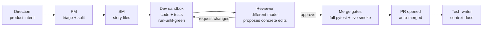

# 🏭 software-factory

**An autonomous software factory: an LLM persona pipeline that turns high-level product directions into reviewed, tested, merged pull requests — unattended, on cheap open-weight models.**


The thesis under test: **harness quality beats model size.** A well-instrumented pipeline of small, verifiable steps — each gated by real tests and a live runtime smoke check — ships production code unattended on models ~10× cheaper than frontier subscriptions. It does ship: 117 stories merged and deployed, 24 of them edits to the factory itself.

**The thesis is not proven, and the latest measurement runs against it.** Externally graded on SWE-rebench with a hidden oracle (2026-08-04, five arms, n=19, k=1 — [full result](bench/swebench/results.md)):

Every arm ran **the same 19 instances**. Every arm produced a patch and got an
oracle verdict on all 19, so every rate below is out of 19 — no arm gets a
smaller denominator than another.

| harness | model(s) | solved | rate | total $ | **$ per solved** |
|---|---|---:|---:|---:|---:|
| Claude Code CLI | `claude-opus-5` | 15/19 | **79%** | 34.36 | **2.29** |
| Claude Code CLI | `claude-opus-4-8` | 14/19 | **74%** | 23.56 | **1.68** |
| one OpenHands agent, **no chain** | `azure/deepseek-v4-pro` | 10/19 | **53%** | ~19.21 † | **~1.92** |
| **this factory's chain** | deepseek-v4-pro + gpt-5.3-codex + gpt-5.4 | 7/19 | **37%** | 35.94 † | **5.13** |
| hand-rolled loop, **no tool calls** | `azure/deepseek-v4-pro` | 1/19 | **5%** | 7.94 | **7.94** |

Reading it:

- **The chain does not beat a single agent on the same model** — 37% vs 53%.
  Across all 19 paired instances the single agent won 4 the chain lost, the chain
  won 1 the agent lost. The gap is **3 instances**, and at this sample size that
  is still indistinguishable from chance (McNemar exact **p=0.375**). A 16-point
  gap that cannot clear significance is exactly what n=19 buys you.
- **The chain is also the most expensive way to solve one** — $5.13, versus
  ~$1.92 for the same model with no chain and **$2.29 for Claude Code**, a
  frontier model. Costing ~1.9× the single agent in total, and **2.7× per solved
  instance**, for fewer solves is the finding.
- **What produces lift is tooling, not orchestration**: 47% with a real editor
  and tool-calling versus 5% with neither, p=0.031. That gap is real; the
  orchestration gap is not.
- Claude Code roughly doubles the factory (p=0.008), but that comparison changes
  the harness *and* the model at once, so treat it as a reference point, not a
  measurement of the chain.

**† Both Azure figures undercount, and the OpenHands one is adjusted.** Three of
the 19 OpenHands runs crashed their sandbox session and recorded `cost_usd: 0`
with `tokens_in: 0` while running 27% of that arm's agent actions — and two of
those three still resolved. Its metered $15.37 therefore covers 16 of 19 rows;
the table shows $18.26, extrapolated from the 16 reliable rows' $0.961 mean. The
factory arm has a smaller version of the same leak (two rows carry an unmetered
dev session), so its $35.94 is a floor too. After the re-run, 18 of 19 OpenHands
rows are metered at $18.20; the last one hit the wall-clock cap and again
recorded $0, so the table extrapolates it at the 18-row $1.011 mean. Corrected,
the chain costs **~1.9×** the single agent in total and **2.7× per solved
instance** — the direction is unchanged and the harness debt is filed.

**Cost units are not identical either, so don't over-read the last column.** The
Azure rows are a price-table estimate over provider-reported tokens — real money.
The Claude rows are what the CLI itself reports at API list prices, billed in
practice against a flat subscription. Same order of magnitude, not the same
meter.

**The three re-run rows, disclosed in full.** Three OpenHands rows died on Azure
`429` rate limits mid-conversation, recording no cost and no tokens. Because a
provider rate limit is an infrastructure failure rather than a result, those
three — and only those three — were re-run. Both attempts are recorded and the
harness flags them in a "Discarded runs" section, since its own rule is
no-re-rolls; this is a deliberate, disclosed exception to that rule, not a
silent one.

Outcomes: `jsonpickle-588` resolved both times, `rapid-mlx-289` resolved both
times, and **`keras-22316` flipped from wrong-fix to resolved on the second
draw.** So the conservative reading is 9/19 = 47% (first attempts) and the
re-run reading is 10/19 = 53%; the table shows the latter because it is the
metered, graded, audit-valid run. Both readings sit above the chain's 7/19, and
neither reaches significance. That one row in three flipped on a reseed is also
the clearest evidence on this page that single-seed results at n=19 are unstable.

One bare row was separately disqualified for fetching upstream source — it was a
wrong fix anyway, so bare is 1/19 either way.

**What the ± ranges in `results.md` mean.** 7 solved out of 19 is 37%, but 19
samples cannot pin down true skill: the 95% confidence interval [16%, 62%] is
the band of true rates that would not be surprised by this result. The factory's
band [16%, 62%] and the single agent's [20%, 70%] overlap almost entirely, which
is the whole point — **at n=19 we cannot tell these two apart.** The smallest
difference this sample could reliably detect is roughly ±38 points, so the
finding is "**no measurable lift**", not "the chain hurts". Running each instance
3+ times is what would sharpen it.

The July 2026 campaign read the other way, but it graded the factory against
sacrifice's *own* merge gates — tests the factory itself wrote — so it could not
measure correctness at all. Its numbers are withdrawn, not merely superseded:
see [the campaign's retraction header](bench/CAMPAIGN-2026-07-17.md).

> **An LLM agent working in this repo?** Read [`CLAUDE.md`](CLAUDE.md) first (or
> [`AGENTS.md`](AGENTS.md) if you're on a non-Claude tool) — it is the short,
> maintained orientation doc: the three loops, the 60-second health check, where
> truth lives, the operator command surface, and the hard guardrails. This
> README is the human-facing pitch; the deep per-subsystem docs live at
> `apps/factory/context/modules/*.md`.

---

## How it works



- **Directions** are markdown work orders (`apps/<app>/directions/`) — filed by you, or by the factory's own scanner personas (hourly drift watchdog, bug hunter, weekly security audit, UX auditor).
- **Personas** are prompt-defined roles (`factory/personas/*.md`) executed either as tool-using sandboxes (OpenHands SDK) or single structured-JSON calls. Model routing per persona/difficulty lives in one file: `factory/routes.yaml`.
- **Nothing merges on green unit tests alone.** The `smoke-green` gate boots the PR's own code on an isolated port and drives the core user journey live before auto-merge.
- **Convergence machinery** keeps dev↔review loops short: the reviewer carries memory of its own previous findings, proposes concrete `FIND/REPLACE` edits, and a drift clamp stops goalpost-moving at cycle 3.

## The factory manages itself

A four-tier management pipeline (FMS) watches the factory's own telemetry:

| Tier | Role | Cadence |
|------|------|---------|
| L1 Watcher | summarize event streams, flag anomalies | every 60 s |
| L2 Summarizer | structured concern documents | on escalation |
| L3 Diagnostician | root-cause + unified-diff proposal | on escalation |
| L4 Apply | classify safe/forbidden, branch, test, PR | on proposal |

Blocked stories auto-recover (bounded), stale worktrees get pruned, and a halted factory refuses to burn spend until an operator runs `factory resume`. Every factory self-edit is validated on a cloned staging copy — full suite + import/CLI smoke — before it can touch the live tree; `factory/manager/**` and `bench/**` stay forbidden to self-edit (operator PR only).

## Quickstart

```bash
uv sync --all-extras          # dev extras included — bare `uv sync` omits pytest
uv run pytest -q              # 2182 tests, ~5 min (not the ~30s of the early repo)
uv run factory --help
```

Wire an app (see `apps/sacrifice/config.yaml` for a complete example), then:

```bash
uv run factory pm-sync --app <app>   # triage directions into stories
uv run factory tick --app <app>      # one full pipeline pass
```

Continuous operation runs on two systemd user units: `factory-tick@<app>.timer` (pipeline heartbeat, 5 min) and `factory-manager.service` (FMS L1 daemon). Models and API keys are configured in `factory/routes.yaml` + `.env` (`.env.example` documents every key; Azure OpenAI, DeepSeek, and OpenRouter routing supported out of the box).

Day-to-day operator surface:

```bash
factory inbox                 # everything awaiting a human, across apps
factory status-sync --app X   # pinned [FACTORY] live-status GitHub issue
factory why <story-id>        # per-story event trail
factory resume                # clear an FMS halt (operator-only)
```

## Benchmarks

Two harnesses. Only one of them is evidence about correctness.

**`bench/swebench_adapter.py` — externally graded, five arms, hidden oracle.** Pre-registered tables, archived per-row evidence, and a `report --check` that re-derives the published table byte-for-byte or exits non-zero. The measured result is in the table at the top of this README; the full one with CIs, paired McNemar tests, per-row model ledgers and contamination margins is [`bench/swebench/results.md`](bench/swebench/results.md) ([how it works](bench/swebench/README.md)).

```bash
uv run python bench/swebench_adapter.py report \
  --from-archive bench/swebench/results-archive/2026-08-04T04-18-05.349995Z --check
```

**`bench/bench.py` — convergence only.** It grades the factory on sacrifice's own merge gates, i.e. on tests the factory wrote, so it measures whether the chain drives a story to green unattended and what that costs. It is not evidence about correctness, and its July campaign is superseded. Run it: `uv run python bench/bench.py --help` ([protocol + caveats](bench/README.md)).

## Repository map

```
factory/           the orchestrator
  chain/           state machine, handlers, gates, auto-merge, worktrees
  manager/         FMS tiers (watcher → summarizer → diagnostician → apply)
  personas/        prompt-defined roles (pm, sm, dev, reviewer, …)
  routes.yaml      per-persona model routing — the single model-choice seam
apps/<app>/        per-app config, directions (work orders), stories
bench/             benchmarks
  swebench/        externally graded, five arms, hidden oracle — the real one
  bench.py         convergence harness on the app's own gates
state/             runtime: sqlite db, event streams, worktrees (gitignored)
tests/             1086 tests
```

## Design principles

1. **Verification-first** — a feature is done when it runs live, not when tests pass. (The smoke gate exists because an early version shipped a green-but-unbootable app.)
2. **Decompose by context, not by pipeline stage** — the reviewer sees only the diff + gates + its own review history; the dev owns both code and tests.
3. **Everything loops at most 3–6 times** — retry caps, review-cycle caps, recovery caps. Nothing burns spend unbounded.
4. **The model is a config value** — swapping providers is a YAML edit; missing API keys degrade routes to a working fallback instead of crashing.
