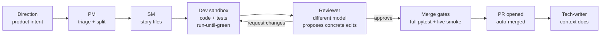

# 🏭 software-factory

**An autonomous software factory: an LLM persona pipeline that turns high-level product directions into reviewed, tested, merged pull requests — unattended, on cheap open-weight models.**


The thesis under test: **harness quality beats model size.** A well-instrumented pipeline of small, verifiable steps — each gated by real tests and a live runtime smoke check — ships production code unattended on models ~10× cheaper than frontier subscriptions. It does ship: 117 stories merged — 24 of them edits to the factory itself. (Two honesty caveats, audited 2026-08-07: the `deployed` story state records a *merge* — real deploys are `deploy_disabled_in_config` on every app and have never executed; and of this repo's own 173 merged PRs, ~25 came through the chain — the operator authored the rest.)

**The thesis is not proven; the gap is closing but the cost gap is not.**
Externally graded on SWE-rebench with a hidden oracle, one pinned set of 19
instances, two sweeps (2026-08-04 five arms; 2026-08-10 re-measuring the
changed factory — [current result](bench/swebench/results.md), sweep-1 archive
re-derivable). Latest number per arm; the **measured** column says how many
times that exact (harness, model) configuration has run this suite:

| harness | model(s) | solved | rate | total $ | **$ per solved** | measured |
|---|---|---:|---:|---:|---:|---|
| **this factory's chain — current config** (acceptance oracle authored pre-dev, open-weight only) | deepseek-v4-pro dev + Kimi-K2.7-Code reviewer/oracle-author | 10/19 | **53%** | 50.18 † | **5.02** | 1× (2026-08-10) |
| the same chain, **no reviewer** (`solo-noreview`) | same | 9/19 | **47%** | 49.89 † | **5.54** | 1× (2026-08-10) ‡ |
| this factory's chain — **previous config** (no oracle, gpt-5.x tiers) | deepseek-v4-pro + gpt-5.3-codex + gpt-5.4 | 7/19 | 37% | 35.94 † | 5.13 | 1× (2026-08-04, superseded) |
| one OpenHands agent, **no chain** | `azure/deepseek-v4-pro` | 10/19 | **53%** | 18.20 † | **1.82** | 1× (2026-08-04; not re-run — harness and model unchanged, operator decision) |
| Claude Code CLI | `claude-opus-5` | 15/19 · 11/14 | **79% both sweeps** | 34.36 / 30.18 | 2.29 / 2.74 | **2×** (CLI 2.1.220 → 2.1.226; run 2 lost 5 cells to the subscription's 5-hour rate window, disclosed) |
| Claude Code CLI | `claude-opus-4-8` | 14/19 | **74%** | 23.56 | **1.68** | 1× (2026-08-04, contamination probe — came back clean, not re-run) |
| hand-rolled loop, **no tool calls** | `azure/deepseek-v4-pro` | 1/18 | **6%** | 7.94 | 7.94 | 1× (2026-08-04; its pre-committed one repaired run is spent) |

Reading it:

- **The current chain matches the single agent's headline rate — 53% vs 53% —
  where the previous config trailed it by 16 points.** Honest caveat: the
  single-agent number is from sweep 1 (the operator chose not to re-run an
  unchanged harness), so that comparison crosses sweeps and is descriptive;
  within sweep 2 the chain was never paired against it.
- **The chain is still the most expensive way to solve one instance** — $5.02
  per solved vs $1.82 for the same model with no chain and $2.74 for Claude
  Code, a frontier model. The rate gap closed; the ~2.8× cost gap did not.
- **What the chain's verdict is worth changed the most**: chain-said-green
  precision moved **40% → 71%**, recall 86% → 100%, and sweep 1's zero-byte
  green did not recur. The reviewer's three nonconvergence parks were all
  genuine oracle failures (3/3 correct).
- **The reviewer still buys no resolves** (10/19 vs 9/19 without it, McNemar
  p=1.000) — and the earlier "−29% cost without the reviewer" finding **did
  not replicate** ($50.18 vs $49.89). What it does buy is verdict precision
  (71% vs 53%).
- **What produces lift is tooling, not orchestration** (sweep 1): 53% with a
  real editor and tool-calling vs 6% with neither, p=0.004 — still the only
  significant pairwise result on the DeepSeek ladder.
- The contamination probe came back **clean** (sweep 1): `claude-opus-4-8`
  74% vs `claude-opus-5` 79%, same harness, p=1.000. Memorisation is not
  carrying the frontier number.
- **None of the sweep-2 movements are proven deltas.** n=19 resolves ±38
  points at best; these cells are now at k=2 and k ≥ 3 is the pre-registered
  bar. The candidate causes of the 37→53 move (oracle layer, Kimi reviewer,
  reviewer rubric, retry cap 4) shipped together and are not separable in
  this design.

**† Cost units are not identical.** The Azure rows are a price-table estimate
over provider-reported tokens — real money, with an *estimated* cache-read
rate. The Claude rows are what the CLI reports at API list prices, billed in
practice against a flat subscription. Same order of magnitude, not the same
meter; never sum them. (Sweep 1's Azure figures are additionally floors: a few
rows carried unmetered crashed sessions, disclosed in that sweep's notes.)

**‡ `solo-noreview` explained.** It is the factory's own chain with exactly one
thing removed: the reviewer round-trip (dev-only, green = dev's tests pass; the
acceptance oracle, sandbox, budgets and gates are identical). It exists to
price the reviewer. An earlier, confounded version of this ablation
(2026-08-05, [B.1 Phase 1a](bench/swebench/RESULTS-B1-PHASE1A.md)) measured
9/18 = 50% at $2.83/solved on the *old* chain config; the clean same-sweep
re-run above (9/19 = 47%, $5.54/solved) **replicates the rate finding and
retracts the cost finding** — without the reviewer, the dev burned the
savings in extra retries.

**Every re-run is disclosed, none silently.** Sweep 1's three OpenHands rows
lost to Azure 429s were repaired once each under
[pre-registration Rule 5](bench/swebench/PRE-REGISTRATION-1.6.md) (one flipped
wrong-fix → resolved on the reseed — the clearest evidence that single-seed
n=19 results are unstable; conservative reading 9/19 = 47%). Sweep 2's Claude
losses to the subscription rate window, the operator's mid-sweep cancellation
of the `openhands` re-run, and one destroyed cell are all recorded in
[the sweep-2 pre-registration's outcome section](bench/swebench/PRE-REGISTRATION-2026-08-10.md).

**What the ± ranges in [`results.md`](bench/swebench/results.md) mean.**
10 solved of 19 is 53%, but 19 samples cannot pin down true skill: the 95%
confidence band is [29%, 76%] — identical to the single agent's. **At n=19
these arms cannot be told apart**; the smallest difference this sample could
reliably detect is roughly ±38 points. Running each instance 3+ times is what
would sharpen it, and k ≥ 3 is the pre-registered bar before any delta is
quoted as a result.

The July 2026 campaign read the other way, but it graded the factory against
sacrifice's *own* merge gates — tests the factory itself wrote — so it could not
measure correctness at all. Its numbers are **withdrawn**, not merely superseded:
see [the campaign's retraction header](bench/CAMPAIGN-2026-07-17.md).

> **An LLM agent working in this repo?** Read [`CLAUDE.md`](CLAUDE.md) first (or
> [`AGENTS.md`](AGENTS.md) if you're on a non-Claude tool) — it is the short,
> maintained orientation doc: the three loops, the 60-second health check, where
> truth lives, the operator command surface, and the hard guardrails. This
> README is the human-facing pitch; the deep per-subsystem docs live at
> `apps/factory/context/modules/*.md`.

---

## How it works



- **Directions** are markdown work orders (`apps/<app>/directions/`) — filed by you. (The scanner personas that used to machine-file them — drift watchdog, bug hunter — are scheduled for deletion per the 2026-08-07 operator decision: 0 findings in 705 runs, and 70% of one app's backlog was machine-filed noise. Goal supply is human-ratified.)
- **Personas** are prompt-defined roles (`factory/personas/*.md`) executed either as tool-using sandboxes (OpenHands SDK) or single structured-JSON calls. Model routing per persona/difficulty lives in one file: `factory/routes.yaml`.
- **Nothing merges on green unit tests alone.** The `smoke-green` gate boots the PR's own code on an isolated port and drives the core user journey live before auto-merge.
- **Convergence machinery** keeps dev↔review loops short: the reviewer carries memory of its own previous findings, proposes concrete `FIND/REPLACE` edits, and a drift clamp stops goalpost-moving at cycle 3.

## The factory manages itself — scope cut 2026-08-07

Factory self-edits go through the chain like any other story and must pass the
**staging twin** (`factory/manager/staging.py`): the diff is applied to a clone,
the clone is actually run, and only a healthy clone promotes (17 validated,
3 fatal self-edits rejected). `recovery.py` auto-fixes known operational faults,
and a halted factory refuses to burn spend until an operator runs
`factory resume`. `factory/manager/**` and `bench/**` stay forbidden to
self-edit (operator PR only).

The four-tier LLM pipeline that used to sit above this (L1 Watcher → L2
Summarizer → L3 Diagnostician → L4 Apply) was **deleted by operator decision
(2026-08-07)**: it consumed 52% of all-time LLM spend, filed one GitHub issue,
and applied zero fixes (L4: 0 PRs in 163 attempts). Its replacement is
deterministic: the pure-Python detectors fire on facts, file deduplicated
directions into the normal chain, and the firing detector itself is the
acceptance criterion — though as of this deletion the detectors have zero
production callers (the deleted L1 Watcher was the only invoker); direction
019 (AC7) rewires them into the chain tick. See `STATUS.md` and the
Exteroception v1 direction.

## Quickstart

```bash
uv sync --all-extras          # dev extras included — bare `uv sync` omits pytest
uv run pytest -q              # 2,368 tests, ~5 min (not the ~30s of the early repo)
uv run factory --help
```

Wire an app (see `apps/sacrifice/config.yaml` for a complete example), then:

```bash
uv run factory pm-sync --app <app>   # triage directions into stories
uv run factory tick --app <app>      # one full pipeline pass
```

Continuous operation runs on the `factory-tick@<app>.timer` systemd user unit (pipeline heartbeat, 5 min). There is no manager daemon anymore — `factory-manager.service` (the FMS L1 daemon) was retired 2026-08-07 along with the four LLM tiers. Models and API keys are configured in `factory/routes.yaml` + `.env` (`.env.example` documents every key; Azure OpenAI, DeepSeek, and OpenRouter routing supported out of the box).

Day-to-day operator surface:

```bash
factory inbox                 # everything awaiting a human, across apps
factory status-sync --app X   # pinned [FACTORY] live-status GitHub issue
factory why <story-id>        # per-story event trail
factory resume                # clear an FMS halt (operator-only)
```

## Benchmarks

Two harnesses. Only one of them is evidence about correctness.

**`bench/swebench_adapter.py` — externally graded, five arms, hidden oracle.** Pre-registered tables, archived per-row evidence, and a `report --check` that re-derives the published table byte-for-byte or exits non-zero. The measured result is in the table at the top of this README; the full one with CIs, paired McNemar tests, per-row model ledgers and contamination margins is [`bench/swebench/results.md`](bench/swebench/results.md) ([how it works](bench/swebench/README.md)).

```bash
uv run python bench/swebench_adapter.py report \
  --from-archive bench/swebench/results-archive/2026-08-04T23-19-24.998844Z --check
```

**`bench/bench.py` — convergence only.** It grades the factory on sacrifice's own merge gates, i.e. on tests the factory wrote, so it measures whether the chain drives a story to green unattended and what that costs. It is not evidence about correctness, and its July campaign is superseded. Run it: `uv run python bench/bench.py --help` ([protocol + caveats](bench/README.md)).

## Repository map

```
factory/           the orchestrator
  chain/           state machine, handlers, gates, auto-merge, worktrees
  manager/         staging twin, recovery, circuit breaker, signals/halt, detectors (the four LLM tiers were deleted 2026-08-07)
  personas/        prompt-defined roles (pm, sm, dev, reviewer, …)
  routes.yaml      per-persona model routing — the single model-choice seam
apps/<app>/        per-app config, directions (work orders), stories
bench/             benchmarks
  swebench/        externally graded, five arms, hidden oracle — the real one
  bench.py         convergence harness on the app's own gates
state/             runtime: sqlite db, event streams, worktrees (gitignored)
tests/             1086 tests
```

## Design principles

1. **Verification-first** — a feature is done when it runs live, not when tests pass. (The smoke gate exists because an early version shipped a green-but-unbootable app.)
2. **Decompose by context, not by pipeline stage** — the reviewer sees only the diff + gates + its own review history; the dev owns both code and tests.
3. **Everything loops at most 3–6 times** — retry caps, review-cycle caps, recovery caps. Nothing burns spend unbounded.
4. **The model is a config value** — swapping providers is a YAML edit; missing API keys degrade routes to a working fallback instead of crashing.
